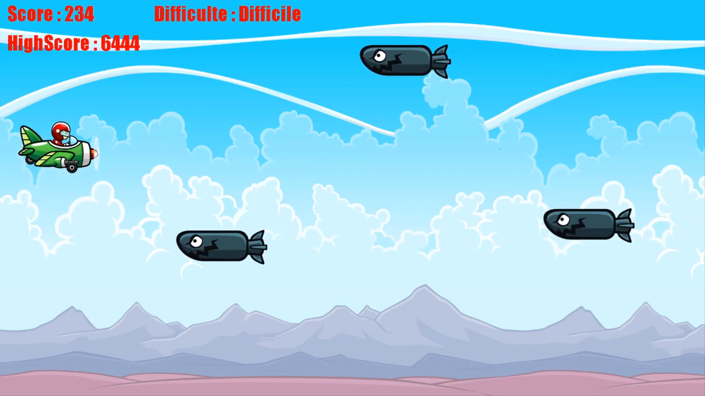

<h1 align="center"> Plane 👋</h1>

> Plane Game est un jeu d'arcade, le but est simple : éviter les torpilles en controlant l'avion avec les touches directionnelles de votre clavier ou le [Myo](https://github.com/tayfuzun/MyoSharp)

### 🏠 [Homepage](https://github.com/B3njaminV/monogame-plane-game)

## 📍 Prérequis

- C#
- Monogame

## ‍💻 Lancement (dans le dossier executable)
#### 1 - Définir PlaneGame.Core comme projet de démarrage (si ce n'est déjà fait)
#### 2 - F5 sur la solution et amusez-vous !

## ⚙️ Configuration
Notre jeu a la possibilité d'être joué avec le périphérique [Myo](https://github.com/tayfuzun/MyoSharp).
Myo est un brassard qui contrôle vos mouvemements pour déclencher diverses actions sur votre ordinateur.

Pour jouer avec le [Myo](https://github.com/tayfuzun/MyoSharp), vous devrez avant toute chose le calibrer et placer le boolean myoOrNot à **true** dans la classe `Avion.cs`

## 🖊️ Documentation
Vous pourrez trouver la documentation de notre projet dans `PlaneGame.Core/DiagrammeDeClasse.cd`.

Notre modèle a été pensé comme pouvant être étendu. A l'avenir, notre modèle permet d'ajouter d'avantage d'avions ou d'obstacles comme d'autres types de torpilles. 

## 🎥 Vidéo
Afin de mieux visualiser notre projet, [cliquez-ici](https://youtu.be/j9RbK7ho_t0) pour trouver une vidéo de test avec le [Myo](https://github.com/tayfuzun/MyoSharp).

## ✍️ Auteur

👤 **VALLEIX Benjamin**

* GitHub: [@B3njaminV](https://github.com/B3njaminV)
* LinkedIn: [@Benjamin VALLEIX](https://www.linkedin.com/in/benjamin-valleix-27115719a)

👤 **MIGNOTTE Jules**

* GitHub: [@Mignottus](https://github.com/Mignottus)

## 📝 License

Copyright © 2022

## 🛠  Languages

 
     
     
	 

